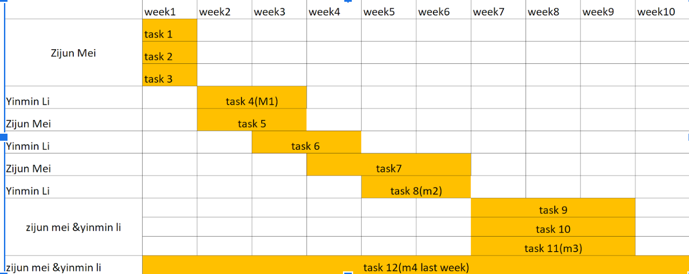
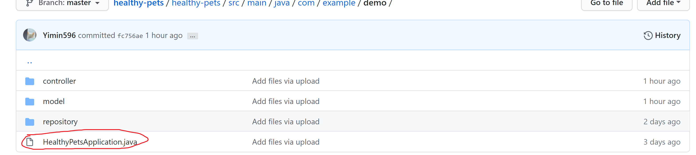
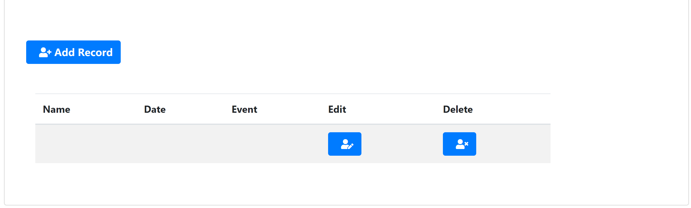
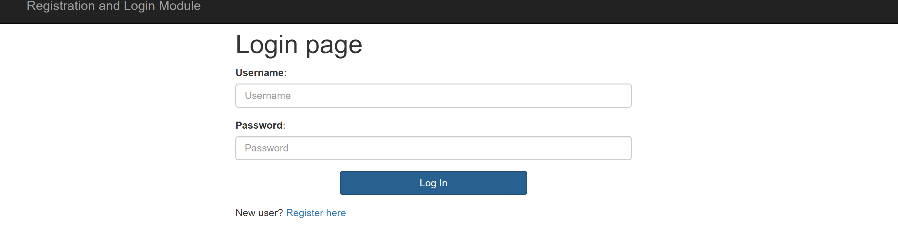
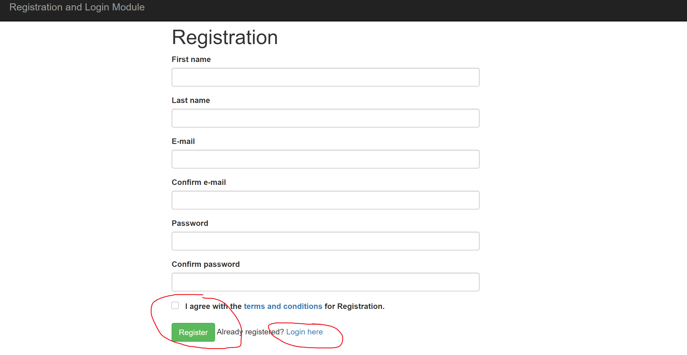
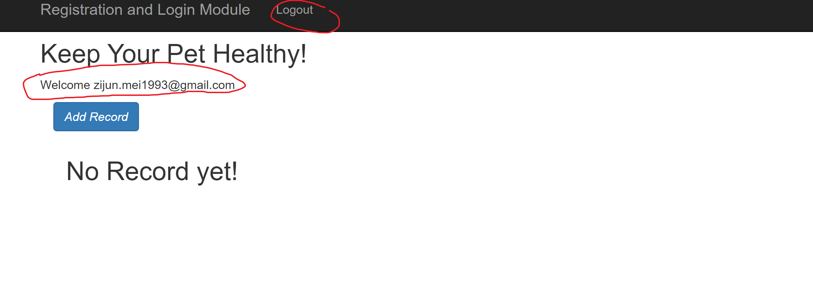
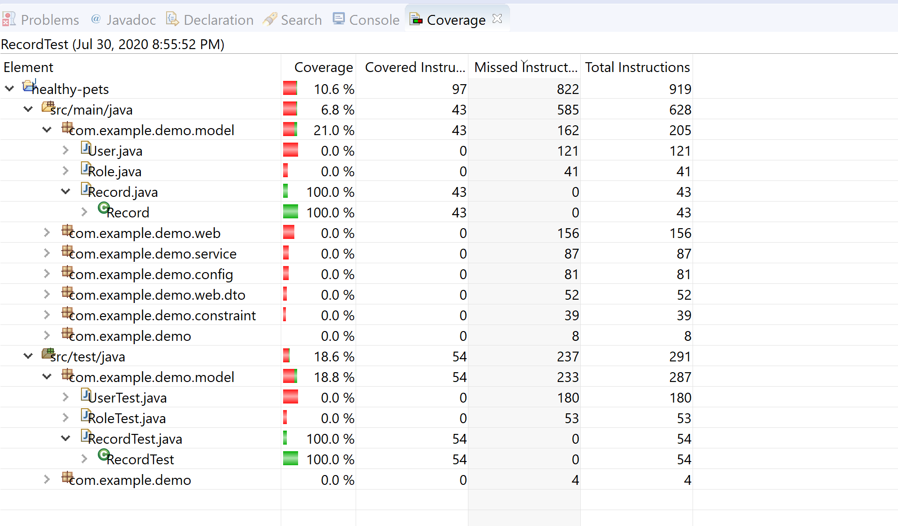
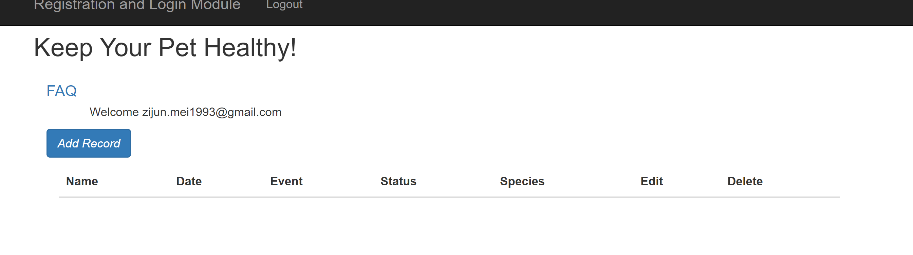

# Web Application of Healthy Pets 
https://healthpet.herokuapp.com/login
## Team member
"**Zijun Mei**" and "**Yimin Li**" 
## Abstract
The application our team would make is called healthy pets. The basic blocks of the application include input, search, output and FAQs page, which represent 4 functions of the application. For the input block, the user basically could type the pet information into the database for recording. The search block is made for users to get the information out of the database by type the keywords such as nickname, species, age. After user types in, the web server will respond and give an output page, which essentially shows the result of the searching or inputting. The FAQs page block is made for users to quickly get the direction to experience an application, and it will effectively improve the satisfaction of the user.
## Work breakdown structure (WBS) 
Task 1: Set up common repository 
Task 2: Set up environment 
Task 3: Realize the insert function of web app 
Task 4: Realize the search function of web app 
Task 5: Set up databases 
Task 6: Create the framework of output html page 
Task 7: Create image by using PS for the outlook of the pages. 
Task 8: Create FAQ pages 
Task 9: Create login page for the user 
Task 10: Connecting the Login page to the user database 
Task 11: Realize the function of the verification of users 
Task 12: Testing for the entire work 
## Schedule Table
 
## Milestone 1
As the schedual table shows, for malestone 1, we simply set up the common repository, set up the environment(srping boot, IDE, etc), and released some basic functions for the app.

 
As the picture showed above, run the java file which called **HealthPetsApplication.java**. After run the file successfully, open the browser and go to URL: http://localhost:8080/ to see the features of the applcation we made so far.

Here is the video of milestone 1. URL: https://use.vg/5Eu3i7.
## Release Notes

Since this is the first time we try to make a web application and there is only two members in our team, we barely have a direction to the target so that we have to keep in touch and working together all the time for making our work is on the right track. We edited the project plan which we create at the very first so that it can looks more reasonable(the original task 1 is to set up the cloud server, and now is to make the common repository). 
So far we create a some basic functions for reacording the information of the pets.

 
Based on the pictures showed above, we could see that the app are simply functionlized the creating, recording, editing and deleting.
## Milestone 2

As the schedual table shows, for malestone 2, we successfully realized  
Task 5: Set up databases 
Task 6: Create the framework of output html page 
Task 7: Create image by using PS for the outlook of the pages. 
Task 8: Create FAQ pages 
Task 9: Create login page for the user 
Task 10: Connecting the Login page to the user database 
Task 11: Realize the function of the verification of users 
     
     As the picture shows above, it is the new login page we recently made. Especially, it not only has a simple login buttom but also has a registeration buttom so that we almost made a login page which has a complete function.
     
     As the picture shows above, when we right click the register buttom in login page, it will jump to register page. it not only could provide regisration functionality but also could verify whether the user's email has been registered. You may notice that the password verify function be realized as well.
     
     As the picture shows above, after we successfully registerad and login, the personal page will be shown. This part mainly about our team has done in milestone one. However, we still add a new function which is to log out your account.
     Here is the video instruction of the milestone 2: https://use.vg/agHE0w
## Release Notes for milestone 2

Since we failed deployment so many times, the self-confidence of us has been hit. We barely have a direction to figure out the problem so that we have to keep in touch and working together all the time for making our work is on the right track. We revised some functions we made initially. We are wondering that set up the cloud server may be a good idea  
So far we create a security check , registeration, recording, delete, edit, and log out function.

## Milestone 3

For the milestone 3, we've simply done with the application deployment. By using heroku cloud platform service, we finally could see what we have done so far without using LocalHost. Now people are able to see what we have by simply click an url:  https://healthpet.herokuapp.com/login. 
In this mile stone we also test part of our application by using Junit test. Here below is the screen shot of the test. 

We also add more column for user to record pet's information to help them with knowing their pets more. Here are the screen shot.  

Here is the video instruction of the milestone 3: https://use.vg/hj9s4L
## Release Notes for milestone 3

By testing the application, we found that there are many bugs appears in our application. One of them is the user do not have a personal information database. To solve this, we believe that make a reference to the user database table then each user will have their own information recording table  
We will continue to test our application by using automated test script in following week.
So far we create a security check , registeration, recording, delete, edit, and log out function.
## Milestone 4

For the milestone 4, we've  done with the entire application development. By using heroku cloud platform service, users are able to see what we have done by simply click an url:  https://healthpet.herokuapp.com/login. 
In this mile stone we also fixed the bug of index page display error and record list display error.  
We also add a FAQ page for display applcation information and questions user most concerned about. 
Finally, we optimized the application by add the return bottom in each page so that user will have a better experience. 

Here is the video instruction of the milestone 4: https://use.vg/hj9s4L
## Release Notes for milestone 4

Most of the time, during the period of milestone 4, we are doing test and debugging. what we learned is a well prepared project is always better than temporary idea. 
A rigorous design process can save a lot of time during the developing.  

